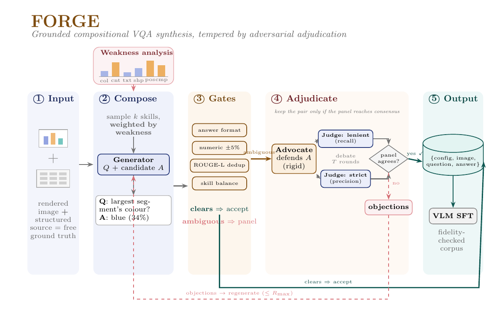

# synth_vlm_data

Synthetic / augmented data-generation pipelines for vision-language model (VLM) SFT, built to
enrich chart & document understanding (InfoVQA / ChartQA-style tasks). Four pipelines:

| Dir | Pipeline | What it produces |
|---|---|---|
| [`chartgalaxy/`](chartgalaxy/) | **ChartGalaxy QA generation** — English, image-verified QA over real + synthetic chart infographics, generated *and* verified by a VLM (Qwen3.6-27B-FP8) in image mode. | `{config, image, question, answer, tier, rationale}` JSONL |
| [`cosyn/`](cosyn/) | **CoSyn-400K** download + manifest builder for text-rich synthetic images (doc / table / nutrition / chart / diagram / graphic / math). | `{config, image, question, answer}` JSONL |
| [`compact/`](compact/) | **COMPACT** compositional atomic-to-complex QA (arXiv:2504.21850) — samples `k` atomic capabilities/image and generates one question integrating exactly those `k`, then verifies. Upstream code + our Qwen-vLLM backend. Runs over CoSyn images. | LLaVA conversations → `{config, image, question, answer}` JSONL |
| [`forge/`](forge/) | **FORGE** — fidelity-checked VQA: cheap deterministic grounding gates, then an *adversarial panel* (rigid advocate + lenient/strict judges must reach consensus) with dissent-driven refinement. Verifies existing QA or sits downstream of a generator. | fidelity-checked `{config, image, question, answer}` JSONL |

## chartgalaxy — the QA generator

Generate + verify multi-tier QA (structural / data-retrieval / reasoning / visual) grounded in the
DVQA / PlotQA / FigureQA / ChartQA taxonomy. Quality controls: single-value answers, CoT rationale,
numeric groundedness (±5% vs the chart's data table), ROUGE-L dedup, and per-tier balance.

- [`chartgalaxy/README.md`](chartgalaxy/README.md) — quick start
- [`chartgalaxy/PIPELINE.md`](chartgalaxy/PIPELINE.md) — end-to-end stages (download → serve VLM → generate+verify)
- [`chartgalaxy/qa_spec.md`](chartgalaxy/qa_spec.md) — question taxonomy
- [`chartgalaxy/SOTA_pipelines.md`](chartgalaxy/SOTA_pipelines.md) — survey of comparable chart-QA pipelines
- [`chartgalaxy/gen_qa.py`](chartgalaxy/gen_qa.py) — the generate+verify client (OpenAI-compatible endpoint)

## cosyn — CoSyn-400K builder

- [`cosyn/download.py`](cosyn/download.py) — pull CoSyn-400K configs and materialize images
- [`cosyn/build_final.py`](cosyn/build_final.py) — normalize into a training manifest (3 QA/image cap)

## compact — compositional capability tuning

A faithful integration of **COMPACT** (Yang et al., [arXiv:2504.21850](https://arxiv.org/abs/2504.21850),
[princetonvisualai/compact](https://github.com/princetonvisualai/compact)). Core files are copied
verbatim from upstream; we add a pluggable backend so it runs on our self-hosted **Qwen (vLLM,
OpenAI-compatible)** with no external API key (Gemini still available via `--backend gemini`), a
converter to our manifest schema, and a SLURM runner that generates over **CoSyn** images.

- [`compact/README.md`](compact/README.md) — attribution, taxonomy, and how to run
- [`compact/backends.py`](compact/backends.py) — Qwen-vLLM / Gemini client (our addition)
- [`compact/run_compact_cosyn_8gpu.slurm`](compact/run_compact_cosyn_8gpu.slurm) — serve Qwen ×8 + generate k=1,2,3 over CoSyn + assemble manifest

## forge — fidelity-checked VQA via adversarial adjudication

FORGE upgrades answer verification from a single model pass to an **adversarial panel**: cheap
deterministic grounding gates run first (answer format, numeric ±5% vs. source, ROUGE-L dedup), and
only the ambiguous residual goes to a rigid **Advocate** + a **lenient (recall)** and a **strict
(precision)** judge that must reach **consensus**; on dissent it refines the answer and re-adjudicates.
Step ② can weight skill sampling by a **model weakness profile** to oversample weak capabilities. The
adversarial-debate idea is adapted from [arXiv:2604.25203](https://arxiv.org/abs/2604.25203),
retargeted to VQA answer-correctness.

- [`forge/README.md`](forge/README.md) — attribution, stages, and how to run
- [`forge/debate.py`](forge/debate.py) — asymmetric debate + refinement; `single_verify()` baseline
- [`forge/forge_verify.py`](forge/forge_verify.py) — gates → panel orchestrator (resumable)
- [`forge/run_forge_cosyn.slurm`](forge/run_forge_cosyn.slurm) — serve Qwen ×8 + verify CoSyn QA on a worker

## Notes

- **Code and docs only.** Generated JSONL, downloaded images, and sample charts are **not** tracked
  (see `.gitignore`) — regenerate them with the download/build scripts. The `.slurm` files carry the
  original cluster paths as reference; adapt roots/partitions to your environment.
- **Licensing:** ChartGalaxy's own license is unsettled (HF `cc-by-nc-4.0` vs GitHub `Apache-2.0`),
  and real infographics originate from third parties (e.g. Statista, Pew) — clear source terms
  before any commercial use of data these scripts fetch. This repo (the pipeline code) is Apache-2.0.
